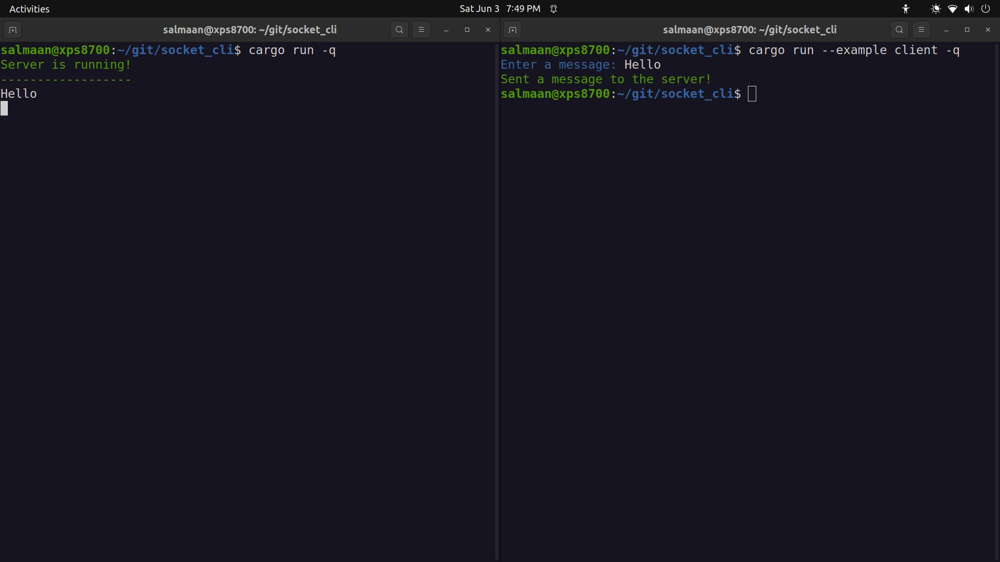
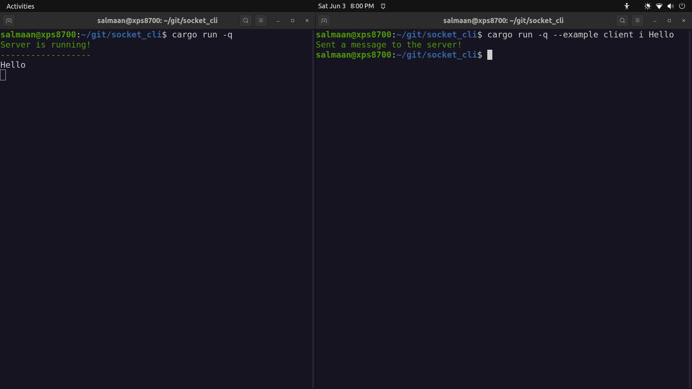

# Socket CLI


## Using Input Option
This uses the input option to specify the message



## Run the Project
Start up the server
```
cargo run
```

Open a new terminal tab and send a message to the server (client)
```
cargo run --example client
```

OR

```
cargo run --example client i Hello
```


## Lint the Project
```
cargo clippy --all -- -W clippy::all -W clippy::pedantic -W clippy::nursery -W clippy::cargo -W clippy::unwrap_used -W clippy::missing_docs_in_private_items -A clippy::multiple_crate_versions -D warnings
```
